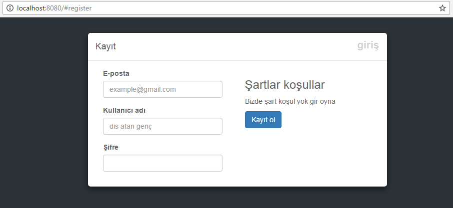

CoinHunters
=============

A Gluon architecture example project. Frontend is pure javascript. Goal is creating a restful service with socket interface. 

Architecture
--------------
- src
  - models
    - room
    - user
  - public
    - images
    - page
      - dashboard
      - login
      - register
      - room
    - app.css
    - index.html
    - router.js
    - utils.js
  - routes
    - v1
      - room
        - info/{id}
        - active
        - create
      - user
        - online
        - random
        - search
      - login
      - < socket > move
      - register
    - index
  - app
- test
  - dev
    - beforeSync
    - dummyLoader
  - unit

Images
------------

